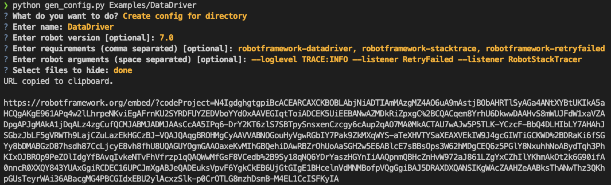

# robotframework-code-examples
a repo with some examples

These templates are used to define own code examples.

- https://robotframework.org/code/?code-gh-url=https://github.com/Snooz82/robotframework-code-examples/tree/main/Examples/SingelTestFile
- https://robotframework.org/code/?code-gh-url=https://github.com/Snooz82/robotframework-code-examples/tree/main/Examples/OneRobotOnePy
- https://robotframework.org/code/?code-gh-url=https://github.com/Snooz82/robotframework-code-examples/tree/main/Examples/OneRobotOnePyOneTxt
- https://robotframework.org/code/?code-gh-url=https://github.com/Snooz82/robotframework-code-examples/tree/main/Examples/XML-File
- https://robotframework.org/code/?code-gh-url=https://github.com/Snooz82/robotframework-code-examples/tree/main/Examples/OneRobotOneJSON
- https://robotframework.org/code/?code-gh-url=https://github.com/Snooz82/robotframework-code-examples/tree/main/Examples/TwoRobot
- https://robotframework.org/code/?code-gh-url=https://github.com/Snooz82/robotframework-code-examples/tree/main/Examples/TwoRobotOne__Init__/
- https://robotframework.org/code/?code-gh-url=https://github.com/Snooz82/robotframework-code-examples/tree/main/Examples/TwoRobotOnePy/
- https://robotframework.org/code/?code-gh-url=https://github.com/Snooz82/robotframework-code-examples/tree/main/Examples/TwoRobotOnePyOneResource/
- https://robotframework.org/code/?code-gh-url=https://github.com/Snooz82/robotframework-code-examples/tree/main/Examples/TwoRobotFourResource/

## Generate own examples

To generate own examples as url, you can use 'gen_config.py'.

It opens a menu and let you configure the examples.
It parses the files that are directly in the directory and creates a config file for the robotframework code examples.

### Install requirements

`pip install -r requirements.txt`

### Run gen_config.py

`python gen_config.py <path_to_directory>`